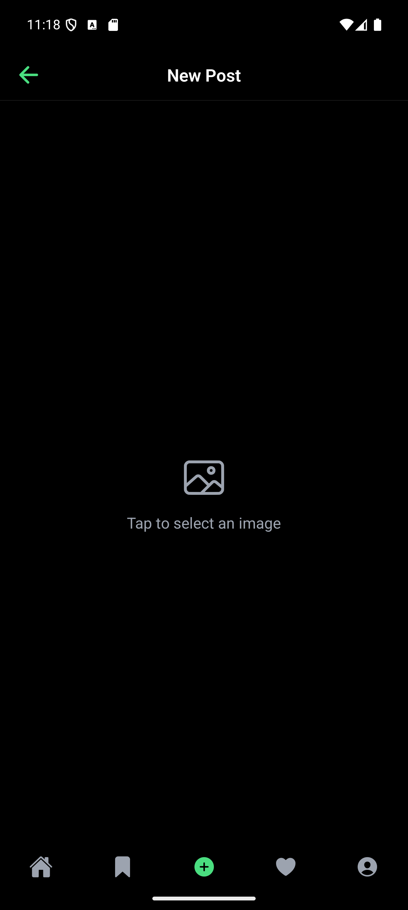
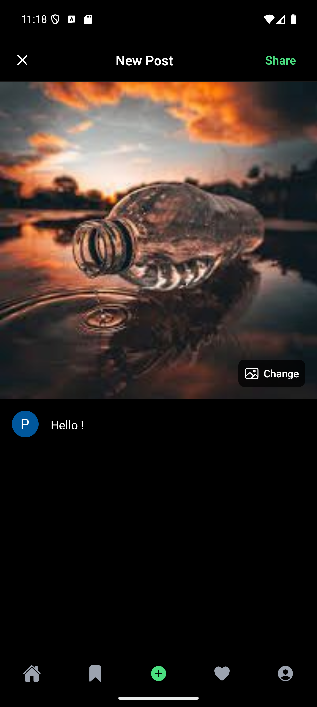

# Demo

<div style="display:flex;gap:4px;flex-wrap:wrap;">
   
   
   
   
   
   
   
   
   
</div>

# Setup

To get started with this project, you will need to set up the following services:

- [Clerk](https://clerk.com/docs/quickstarts/expo): Authentication provider
  - Setup webhook
- [Convex](https://docs.convex.dev/quickstart/react-native): Cloud Database

Follow the respective documentation to create and configure your accounts.

# Run

To run the project locally, follow these steps:

1. Clone the repository:

   ```sh
   git clone <repository-url>
   cd <repository-directory>
   ```

2. Install the dependencies:

   ```sh
   npm install
   ```

3. Start the Convex development server:

   ```sh
   npx convex dev
   ```

4. Start the Expo development server:
   ```sh
   npm start
   ```

You can now open the Expo app on your device or emulator to see the project in action.
